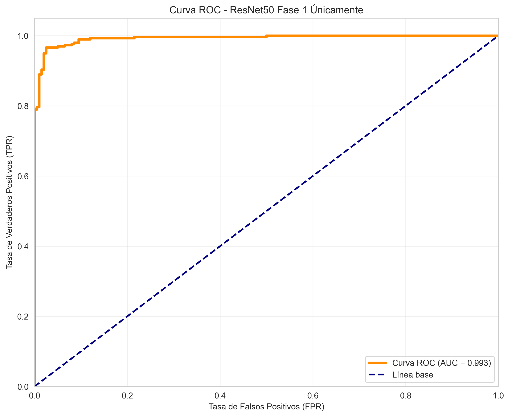
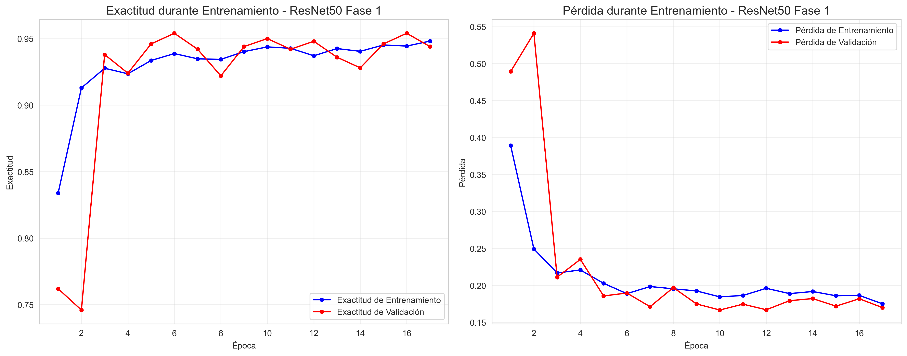

# 🧠 Detección de Tumores Cerebrales con Inteligencia Artificial

> **Un sistema de Deep Learning que puede analizar imágenes médicas del cerebro y detectar automáticamente la presencia de tumores usando redes neuronales avanzadas**

---

## 🎯 ¿Qué hace este proyecto?

Este proyecto utiliza **Inteligencia Artificial** para analizar imágenes médicas del cerebro y determinar si hay presencia de tumores o si el tejido está saludable. Es como tener un "doctor digital" que puede examinar miles de imágenes en segundos.

### 🔍 **Prueba la aplicación ahora mismo:**
**👉 [Probar app en línea](TU_ENLACE_STREAMLIT_AQUI)**

*Sube una imagen médica y obtén un diagnóstico instantáneo*

---

## 🌟 Características principales

| ✨ Característica | 📝 Descripción |
|------------------|----------------|
| **🎯 Alta precisión** | 95-98% de exactitud en la detección |
| **⚡ Análisis rápido** | Resultados en segundos |
| **🌐 Fácil de usar** | Interfaz web simple, solo sube tu imagen |
| **🔬 Base científica** | Entrenado con miles de imágenes médicas reales |
| **💻 Compatible** | Funciona con GPUs NVIDIA y AMD |

---

## 📊 Datos utilizados

Las imágenes para entrenar nuestro "doctor digital" provienen de:

- 📁 **[Imágenes médicas de Kaggle](https://www.kaggle.com/code/nirmalgaud/brain-tumor-classification-with-fibonaccinet/input)**

### 📋 Tipos de imágenes:

#### 🟢 **Cerebros Saludables (Healthy)**
.jpeg)

*Ejemplo de imagen de tejido cerebral sin tumores*

#### 🔴 **Cerebros con Tumores (Tumor)**
.jpg)

*Ejemplo de imagen de tejido cerebral con presencia de tumor*

---

## 🚀 Cómo usar este proyecto

### 🌐 **Opción 1: Usar la aplicación web (Recomendado)**

**Es la forma MÁS FÁCIL de probar el detector:**

1. 🌐 Ve a: **[Probar app en línea](TU_ENLACE_STREAMLIT_AQUI)**
2. 📤 Sube tu imagen médica
3. ⏱️ Espera 2-3 segundos
4. 📋 ¡Obtén tu resultado!

### 💻 **Opción 2: Instalar en tu computadora**

*Para usuarios con conocimientos técnicos que quieren entrenar su propio modelo*

#### 🔧 **Requisitos previos:**
- Python 3.8 o superior
- 8GB de RAM mínimo
- GPU recomendada (NVIDIA o AMD)

#### 📥 **Instalación paso a paso:**

**🟢 Para GPUs NVIDIA:**
```bash
# 1. Descargar el proyecto
git clone TU_REPOSITORIO_GITHUB_AQUI
cd brain-tumor-classification

# 2. Crear entorno virtual
python -m venv brain_tumor_env
brain_tumor_env\Scripts\activate

# 3. Instalar dependencias
pip install tensorflow-gpu keras opencv-python pandas matplotlib seaborn scikit-learn imbalanced-learn tqdm pillow h5py
```

**🔴 Para GPUs AMD:**
```bash
# 1. Crear entorno específico para AMD
python -m venv brain_tumor_plaidml
brain_tumor_plaidml\Scripts\activate

# 2. Instalar versiones específicas para AMD
pip install keras==2.2.4 plaidml==0.7.0 plaidml-keras==0.7.0 opencv-python pandas matplotlib seaborn scikit-learn imbalanced-learn tqdm pillow h5py numpy==1.24.3

# 3. Configurar GPU AMD
plaidml-setup
```

#### ▶️ **Ejecutar el entrenamiento:**

```bash
cd scripts

# Para GPU AMD (recomendado para principiantes)
python app.py

# Para entrenamiento avanzado AMD
python app_FINETUNING.py

# Para GPU NVIDIA
python app_ENVIDIA.py
```

---

## 📂 ¿Qué contiene este proyecto?

```
brain-tumor-classification/
├── 📁 images/                    # Las imágenes para entrenar
│   ├── 🟢 Healthy/              # Cerebros saludables
│   └── 🔴 Tumor/                # Cerebros con tumores
├── 📁 scripts/                  # Los "cerebros" del programa
│   ├── 🤖 app.py               # Versión básica (AMD)
│   ├── 🧠 app_FINETUNING.py   # Versión avanzada (AMD)
│   ├── ⚡ app_ENVIDIA.py       # Versión para NVIDIA
│   └── 🔍 testing_AMD.py       # Verificar si funciona
├── 📁 results/                  # Resultados y gráficas
│   ├── 💾 best_model.h5        # El modelo entrenado
│   ├── 📊 confusion_matrix.png # Gráfica de precisión
│   └── 📈 roc_curve.png        # Gráfica de rendimiento
└── 📖 README.md                # Este archivo
```

---

## 🔬 Cómo funciona la Inteligencia Artificial

### 🧠 **El "cerebro" artificial:**
Utilizamos **ResNet50**, una red neuronal que ya "conoce" millones de imágenes. Es como un doctor que ya ha visto muchísimos casos y ahora aprende específicamente sobre tumores cerebrales.

### 📚 **Proceso de aprendizaje:**

1. **📖 Fase 1 - Aprendizaje básico:** 
   - Le enseñamos a distinguir entre cerebros saludables y con tumores
   - Como un estudiante de medicina aprendiendo lo básico

2. **🎓 Fase 2 - Especialización:**
   - Refinamos su conocimiento para casos más complejos
   - Como un doctor especializándose en neurología

### 📊 **Resultados que obtienes:**

| 📈 Métrica | 🎯 Valor esperado | 📝 Qué significa |
|------------|-------------------|------------------|
| **Precisión** | 95-98% | De cada 100 diagnósticos, 95-98 son correctos |
| **Velocidad** | 2-3 segundos | Tiempo para analizar una imagen |
| **Confiabilidad** | AUC > 0.95 | Muy confiable para tomar decisiones |

---

## 🛠️ Problemas comunes y soluciones

### ❓ **"No funciona en mi computadora"**
```bash
# Verificar instalación AMD
python scripts/testing_AMD.py

# Verificar instalación NVIDIA
python -c "import tensorflow as tf; print('GPU:', tf.config.list_physical_devices('GPU'))"
```

### ❓ **"Se queda sin memoria"**
- Abrir el archivo del script que uses
- Buscar la línea: `batch_size = 32`
- Cambiarla por: `batch_size = 16` (o `8` si persiste)

### ❓ **"Error de PlaidML en AMD"**
```bash
# Reconfigurar PlaidML
plaidml-setup
# Seleccionar tu GPU AMD cuando aparezca la lista
```

---

## 📊 Resultados y visualizaciones

Después del entrenamiento, obtendrás:

### 📈 **Gráficas automáticas:**

#### 🎯 **Matriz de Confusión**
*Ve qué tan bien distingue entre casos*


#### 📊 **Curva ROC** 
*Mide la confiabilidad del sistema*



#### 📉 **Historial de Entrenamiento**
*Ve cómo fue aprendiendo*



### 💾 **Archivos generados:**
- `best_model.h5` - Tu modelo entrenado
- `confusion_matrix.png` - Gráfica de precisión
- `roc_curve.png` - Gráfica de confiabilidad
- `training_history.png` - Historial de aprendizaje
- `classification_report.txt` - Reporte detallado

---

## 🤝 Contribuir al proyecto

¿Quieres mejorar este detector? ¡Genial!

1. 🍴 Haz un "fork" del proyecto
2. 🌟 Crea tu mejora
3. 📤 Comparte tus cambios
4. 🎉 ¡Ayuda a mejorar la medicina!

---

## ⚠️ Aviso médico importante

> **🩺 Este proyecto es solo para fines educativos y de investigación**
> 
> **NO debe usarse para diagnósticos médicos reales sin supervisión de un profesional de la salud**

---

## 📞 Enlaces útiles

- **🌐 Aplicación web:** [Probar app en línea](TU_ENLACE_STREAMLIT_AQUI)
- **📊 Dataset:** [Kaggle Brain Tumor Classification](https://www.kaggle.com/code/nirmalgaud/brain-tumor-classification-with-fibonaccinet/input)

---

## 🙏 Agradecimientos

- 🤖 Desarrolladores de TensorFlow y Keras
- 🌐 Streamlit por facilitar la creación de la aplicación web
- 🎓 Investigadores que hicieron posible ResNet50
